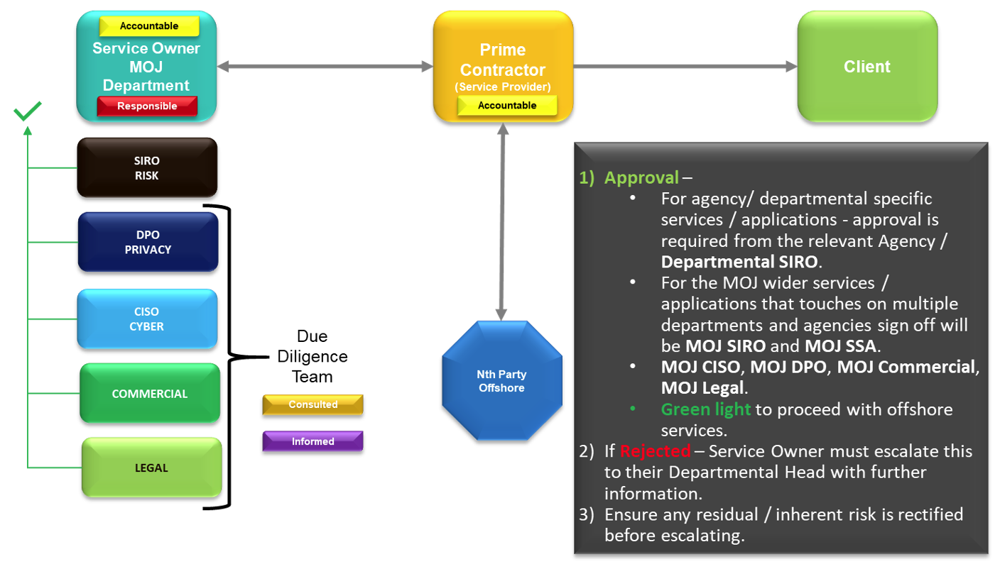

# Offshoring Policy

## Introduction

The Ministry of Justice \(MoJ\) has a large number of outsourced service providers, varying from applications, infrastructure, payment processing, document printing, 1st, 2nd and 3rd line support. These suppliers may utilise their services being supported or hosted onshore or offshore. Onshore means within the United Kingdom \(UK\). Offshore means outside the borders of the UK.

Some contracts, and the underlying policies and processes, might need to be varied according to circumstances.

Offshoring services includes collecting, transferring, storing and processing MoJ [OFFICIAL and OFFICIAL-SENSITIVE](official-official-sensitive.md) data and information. This includes personal, financial and legal information.

Privacy, Security, Commercial, and Legal risks associated with offshoring must be reviewed, and appropriate controls put in place to reduce or mitigate any weaknesses.

### Definition of Offshoring

Offshoring is where any part of the service delivery relating to data is conducted outside the UK, and is therefore potentially subject to non-UK controlled legislation, standards, governance and compliance.

This relates to:

-   Where data and services are physically located.
-   Where the individuals who manage the services - including the development, maintenance, applications and processing systems - are located.
-   Who has access to the data.

## Objectives

This Policy applies to all departments within the MoJ, including all employees and contractors. Non-compliance with the Policy is a serious matter, which could result in the MoJ being exposed to unnecessary risks. Disciplinary action could be taken in the event of a breach of this policy. This policy should be read in conjunction with current MoJ guidance, including the [Information Security Policy](https://intranet.justice.gov.uk/guidance/security/it-computer-security/), [Data Protection Policy](https://intranet.justice.gov.uk/guidance/knowledge-information/protecting-information/privacy-reform/), and [Acceptable Use Policy](acceptable-use-policy.md).

## Purpose

The purpose of this Offshore Security Principles Policy Document is to enable the MoJ to ensure:

-   The confidentiality, integrity, and availability of MoJ information or services that in any way depend upon the offshore supply chain.
-   Key services used by the MoJ are protected and resilient to any adverse failure.
-   Threats, vulnerabilities, risks, and exposure related to offshoring are identified and managed.
-   All MoJ information, assets, and systems have appropriate privacy, security, legal and commercial principles and processes in place, regardless of their offshoring status.

## Policy

All MoJ staff must adhere to the following policy statements:

-   Accountability – all MoJ department heads or system owners must take responsibility and accountability for their services. This includes applications, infrastructure, and service providers. It applies to management of suppliers, regardless of their location.
-   Ensure Privacy, Cyber Security, Commercial and Legal Principles are followed for all Service Providers who provide services to the MoJ, whether Onshore or Offshore.
-   Approval - You must engage with, and get written approval from, Commercial, Legal, Privacy and Security Teams well in advance \(4 weeks\), or as soon as possible, for events including:
    -   Any changes on offshore services, to provide assurance and input to the change.
    -   Notifying other interested parties in the MoJ, including the contract manager of the supplier.
    -   Any change to personal data processing without appropriate assessment or following a potential breach, depending upon circumstances.
-   Comply with the [Data Protection Policy](https://intranet.justice.gov.uk/guidance/knowledge-information/protecting-information/privacy-reform/) and notify the Data Protection Officer \(DPO\) immediately of any suspected data breaches involving personal data. Do this by contacting: [privacy@justice.gov.uk](mailto:privacy@justice.gov.uk).
-   Report any Information Security related Incidents to the MoJ Operational Security Team. Do this by contacting: [security@justice.gov.uk](mailto:security@justice.gov.uk).
-   Ensure the necessary Approvals from the above teams are obtained.

## Process

1.  Obtain the necessary approvals:
    -   For agency or departmental specific services or applications, approval is required from the relevant Agency or Departmental SIRO \(Senior Information Risk Officer\).
    -   For wider MoJ services or applications that involve more than one department or agency, approval is required from the MoJ Senior Information Risk Officer \(SIRO\) and Senior Security Advisor \(SSA\).
    -   All projects additionally require approval from the MoJ Chief Information Security Officer \(CISO\), the MoJ Data Protection Officer \(DPO\), and from MoJ Commercial and MoJ Legal teams.
2.  If all those approvals are obtained and documented, the project can continue as planned.
3.  If one or more of the required approvals cannot be obtained, then the project request is rejected. The Service Owner must then do one or more of:
    -   Adjust plans so that approval is granted.
    -   Escalate to their Departmental Head, providing more detail to support the case for approval. Any residual or inherent risk must be rectified before escalating.
    -   Provde additional or alternative mitigations, to address concerns and so enable approval.
4.  Perform continual monitoring and improvement of services, and appropriate risk management associated with service providers.

For existing contracts, consider how to work with what is already in place, reflecting its criticality to the MoJ. Consider what variations might be required for contacts, and the cost or other implications for doing so.

## Compliance

All staff of MoJ must comply with this policy.

Any request to change part of this policy or exemptions must be sent for formal review and approval by the MoJ Senior Security Adviser and the Chief Information Security Officer, with reasonable justification.

## Feedback

> If you have any questions or comments about this guidance, such as suggestions for improvements, please contact: [itpolicycontent@digital.justice.gov.uk](mailto:itpolicycontent@digital.justice.gov.uk).

