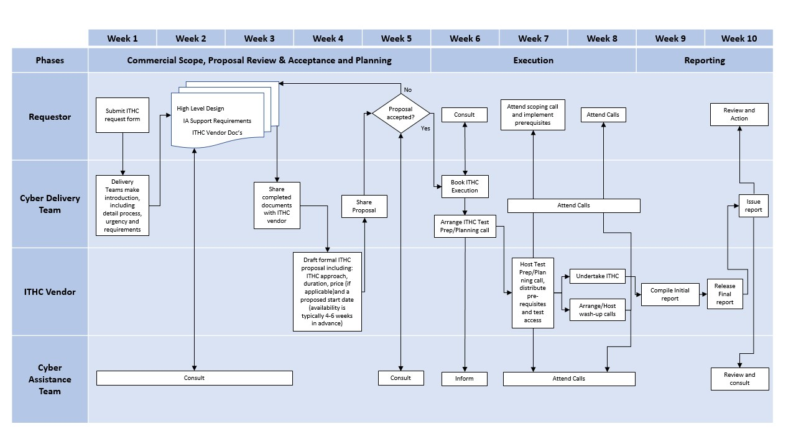

# What is a penetration test?

A penetration test is an interactive security test undertaken for the Ministry of Justice \(MoJ\) to identify security vulnerabilities that are actually exploitable. Penetration testing is conducted from two primary viewpoints: external and internal. An external viewpoint is in the public IP address space. A test of the server hosting this page, from where you are, would be from an external viewpoint. An internal viewpoint requires testing from inside an organisation's private network.

There are many types of penetration tests used by the MoJ, including network penetration tests and host configuration tests, web application penetration tests, wireless network penetration tests, client-server application penetration tests, mobile device penetration tests, and social engineering, to name a few.

## How do I request a penetration test?

For a pen test, contact the [Security Engineering Team](mailto:OperationalSecurityTeam@justice.gov.uk) or you can request a test on our [Google Form](https://docs.google.com/a/digital.justice.gov.uk/forms/d/1oixiLuUeORTv9YuxrfenCowKyGiXBMOpVlJRnR4Z8cM).

### The difference between a penetration test and a vulnerability scan

A penetration test is different from a vulnerability scan. A vulnerability scan is automated and is entirely software. A penetration test is conducted by trained, qualified professionals, and uses human interaction and human ingenuity to discover flaws that automated tools often miss.

### Vulnerability scanning or penetration test?

Vulnerability scans use preconfigured pattern recognition, so there are many aspects of a system that will not be scanned completely. Some will not be scanned at all. Penetration testing provides coverage for large number and variety of serious security faults that scanners are incapable of finding and testing.

## How is testing done?

The Group Security Delivery Team manage the penetration testing as a service offered via 3rd party suppliers.

It is our ambition to centralise the managements and budget for all pen tests within the scope of functional leadership, and to this end the SET team will ensure that pen tests are providing value for money. If we believe that they are not, then we will reject or re-scope them.

An overview of the ITHC Workflow is provided as a [download](../downloads/ITHC%20workflow%20process.pptx), and can be seen in the following diagram:

## New ITHC Assessment Request

To officially register a request for an ITHC, please complete the [Assessment Request form](https://docs.google.com/forms/d/e/1FAIpQLScOcsv8qpM07EmkFy8Y9MdAuUV7jmvyz9_GZznVx39olufVcA/viewform?c=0&w=1) which, upon submission, starts the process. A communication channel within MS Teams will be created to support ongoing engagement.

## Timeline Considerations

It is recommended that an approximate timeline of 8 weeks is considered in your project plan to enable the planning and undertaking of the ITHC. Maturity, size, and complexity of the scope will influence this. It is further recommended that you engage with your Cyber Security Consultant if you haven't already done so.

## Scope Changes

Changes to scope will be reviewed and considered, however there is a risk that this will affect dates, ITHC Provider availability, and end quote price. It is strongly recommended that ITHC scope is understood as much as possible and prior to submission.

## Meeting Windows

Should there be a requirement to meet and discuss the scope with the ITHC provider during the initial review and quote phase, standard meeting windows are provided. Dates are subject to availability. Please note the weekly meeting schedule below:

|Day|Time|
|---|----|
|Tuesday|10:00 - 11:00|
|Thursday|15:00 - 16:00|

If you have any queries then please don't hesitate to ask.

## Test Cancellations and Delays

Cancelling or delaying a test will result in project costs. Information about these is provided [here](test-cancellations-and-delays.md).

