# Secure file transfer

## Introduction

This procedure document assists users who need to share [**Official-Sensitive**](data-handling-and-information-sharing-guide.md#electronic-data-transfer-and-storage) information through a secure encrypted method to partners or external users outside the Ministry of Justice \(MoJ\).

There are several methods [available](general-user-video-and-messaging-apps-guidance.md#tools-for-sharing-information-internally-and-externally) for sending files if the preferred Criminal Justice Secure Exchange \(CJSE\) method is not possible.

**Note:** Regardless of whether the **Official-Sensitive** information is shared with or received from an external party, [out of band checks](glossary.md#out-of-band-checks) **should** be carried out to confirm the legitimacy of the communications and requests.

**Note:** You **shall** comply with MoJ [security policies](cyber-and-technical-security-guidance.md), and refer to guidance on MoJ approved [applications](general-user-video-and-messaging-apps-guidance.md).

## Methods of sharing documents

|Domain|Applications|File size|Internal or external|Examples|
|------|------------|---------|--------------------|--------|
|`*.*@justice.gov.uk`|SharePoint, MS Teams, or OneDrive|Over 25MB|External, including third-party suppliers, legal teams, or other government departments outside of the MoJ.|Multiple files more than 25MB each.|
|`*.*@justice.gov.uk`|Outlook encrypted email|Under 25MB|Internal and external.|Sending a few documents less than 25MB each.|
|`*.*@digital.justice.gov.uk`|Google Workspace|Under 25MB|Internal and external.|Sending a few documents less than 25MB each.|
|`*.*@digital.justice.gov.uk`|Google Drive \(part of Google Workspace\)|Over 25MB|External, including third-party suppliers, legal teams, or other government departments outside of the MoJ.|Multiple files more than 25MB each|

**Note:** The term Google Workspace rather than Google "GSuite" is used now, with Google Drive \(Drive\) included as part of the Google Workspace integrated tools.

**Note:** For further information on the controls in place when sharing sensitive information, refer to the [information sharing](data-handling-and-information-sharing-guide.md#information-sharing) section of the Data Handling and Information Sharing Guide.

## Objectives of this procedure

-   To provide step-by-step instructions on how to transfer files externally.
-   Follow policies and procedures to ensure MoJ information and services are protected.
-   To share information with interested parties on a need-to-know basis only.

## Alternative methods and processes

-   **Criminal Justice Secure Mail \(CJSM\)**

    [CJSM](cjsm.md) is the approved secure email solution.

-   **Data Movement Form \(DMF\)**

    A [DMF](data-handling-and-information-sharing-guide.md#data-movement-form-dmf) is required for all bulk file transfers. All requests **shall** be reviewed and approved by the MoJ [Justice Digital Security Operations Centre \(SOC\)](mailto:security@justice.gov.uk).

**Note:** You **shall not** use personal accounts for work purposes. This includes using personal systems such as Gmail, Hotmail, or Yahoo mail to send or receive emails for work purposes. You **shall** use your officially-issued `*.*@justice.gov.uk` or `*.*@digital.justice.gov.uk` email address for MoJ business.

## Receiving password protected files

It is acceptable to receive password protected files from external parties or from the public. However, you **shall** carry out the following checks:

-   Confirm that the file was received from a known and reputable source or sender. Do this by performing an [out of band check](glossary.md#out-of-band-checks).
-   The password needed to access the file **shall** be shared separately from the file, and **shall not** be provided using the same method as was used to send the file. In other words, if the password protected file is received by email, the password **shall** be received through another method, not by email.
-   The contents of a password protected file cannot always be scanned during entry into MoJ systems. In such cases, the password protected file **shall** go through an isolated local folder or computer disconnected from the network, where it is decrypted and then scanned before progressing further or being uploaded into MoJ systems.

## Sharing files using Microsoft OneDrive or SharePoint

**Note:** A tutorial on Microsoft OneDrive is [available](https://support.microsoft.com/en-us/office/share-onedrive-files-and-folders-9fcc2f7d-de0c-4cec-93b0-a82024800c07). A tutorial on Microsoft SharePoint is also [available](https://support.microsoft.com/en-us/office/share-sharepoint-files-or-folders-1fe37332-0f9a-4719-970e-d2578da4941c).

1.  Go to [https://justiceuk-my.sharepoint.com/](https://justiceuk-my.sharepoint.com/).
2.  Log in with your MoJ `*.*@justice.gov.uk` email account.
3.  Click on the menu dots and select OneDrive.

    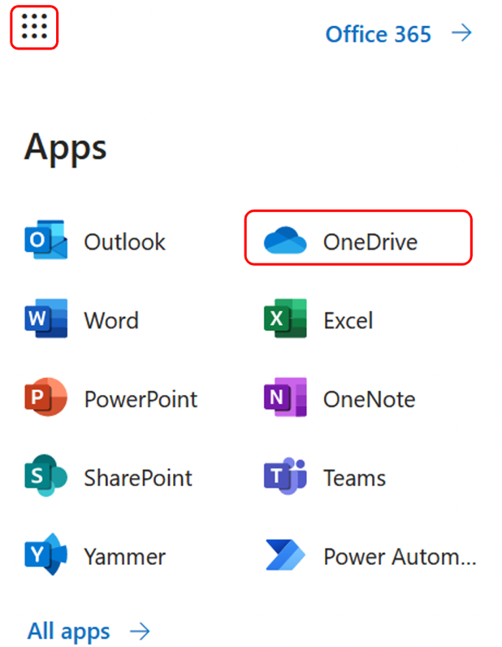

4.  Next, create a new folder. To do this, click on the **New** drop-down arrow, and select the option to create a new folder.

    

5.  Give the new folder a unique name.

    

6.  Upload the file to the newly named folder.

    

7.  Next, share the file. To do this, click on the **Share** option in the menu. Then in the **Send link** box, click on **People in Ministry of Justice with the link can edit**, which takes you to the **Link settings** box.

    

8.  Select the option for **Specific people**, ensure **Allow editing** is unticked, and the **Block download** option is activated. Finally, click on **Apply**. This returns you to the **Send link** box.

    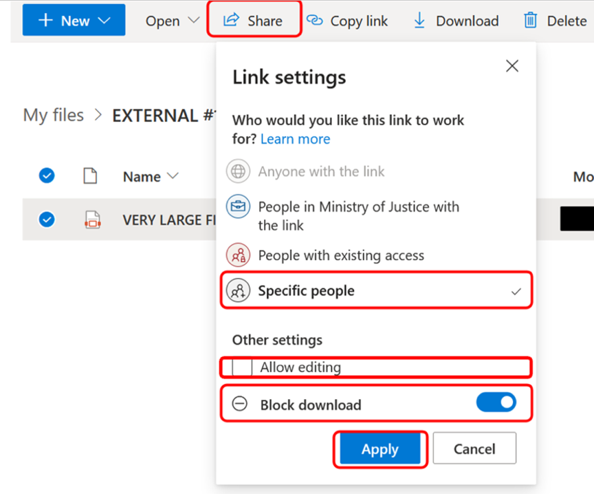

9.  Next, add all the email accounts that should be able to **view** the file. Click the **Send** button.

    

10. When you click the **Send** button, an email is sent from your`*.*@justice.gov.uk` email account to the selected recipients. The email contains a link to the document.

### Recipient receives an email with a link to the file

1.  Each recipient receives a link to the file within the email. They initiate access by clicking on the **Open** button.

    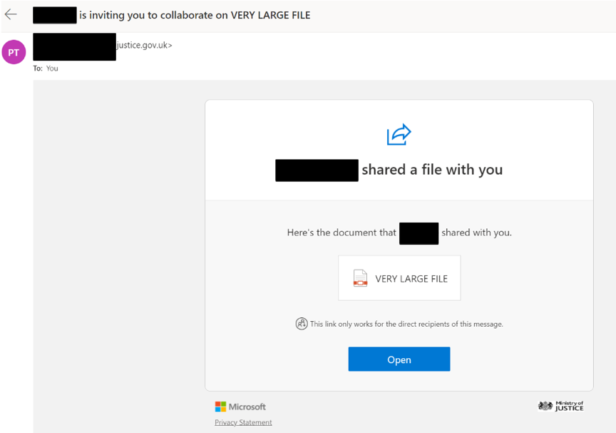

2.  The recipient also receives a separate email to the same registered email address. This secondary email enables access to the file by providing a PIN Code to open the file.

    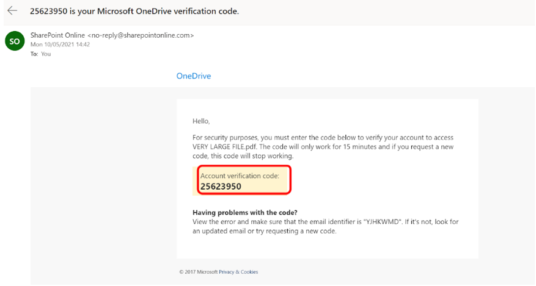

3.  When the recipient clicks the **Open** button in the 'file share' email, they are asked to provide the account verification code before they can access the file content.

## Sharing Files Using Microsoft Teams

**Note:** A tutorial on Microsoft Teams is [available](https://support.microsoft.com/en-us/office/microsoft-teams-video-training-4f108e54-240b-4351-8084-b1089f0d21d7).

1.  Open MS Teams. Click on the Teams icon within the Left Panel. Click on the icon at the bottom of the app called **Join or Create a Team**.

    

2.  Select the **Create a team** applet, and then click the **Create team** button.

    

3.  Select the tab called **From scratch**.

    **Note:** From SharePoint, OneDrive or in a Teams **File** tab right-click, and share.

    

4.  In the window called **What kind of team will this be?**, select the **Private** option.

    

5.  You are invited to provide some quick details about the private team. Enter a team name for the **Give your team a name** field. Since the team is not going to be used for a lot of activity, a simple option is to provide a name that includes the current date and time, to make the name unique. For example, you might use a temporary name such as `ProjectAmberFile2022June08`.

    

6.  You can either add members to your new team now, or skip the step and do it later.

    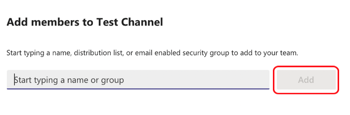

    **Note:** The team is now available within the left panel. It has a **General** tab by default. Within the right panel, you can either start a conversation in the **General** tab, or click on the **Files** tab on the right to upload content for sharing by the team.

7.  You can add external recipients as members of the team by adding their email addresses using the 'triple dot' menu.

    

8.  A Welcome Message is displayed to confirm the team has been created.

    

9.  To add members to the team at any time, click the triple dot menu on the channel name and select **Add members**.

    **Note:** External team members - anyone who does not have an MoJ email account - is added to the team as a 'guest'.

    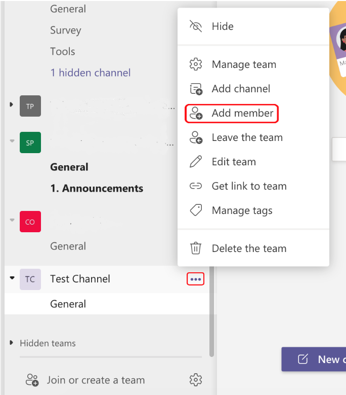

    

10. You can add members to the team, including external users. Use the **Manage Team** option to review user access, modify permissions, and add files to the team 'file share'.

When a recipient is added to a shared folder, they receive an email inviting them to **Join a Teams Folder**. They should use their email address to log in and access the shared information. The email address is the same one used to receive the invitation.

## Sharing files using Microsoft Outlook

1.  If you are using a Mac client laptop, once you have completed the content of your Outlook email, from the email menu bar, select **Options** and then click on **Encrypt**.

    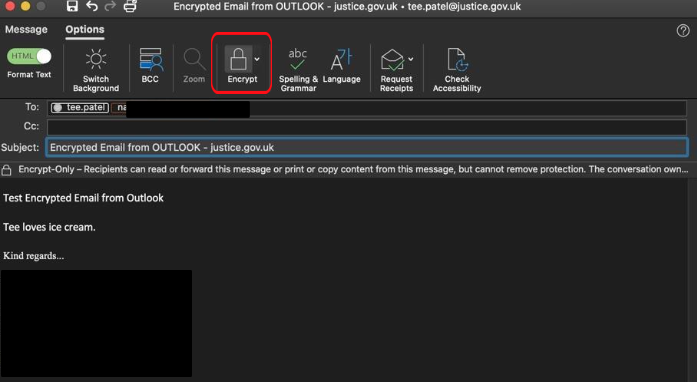

    If you are using a Windows client laptop, once you have completed the content of your Outlook email, from the email menu bar, select **Options** and then click on **Encrypt**.

    

2.  When an authorised recipient receives the message, to read it they select **Options** and then click on the **Read the message** tab.

    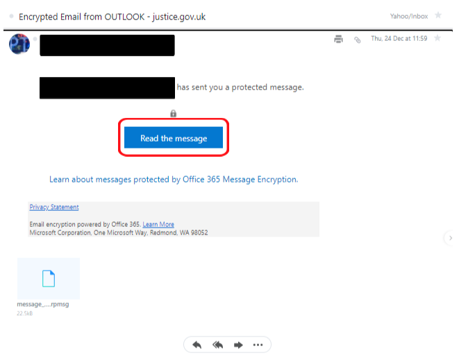

3.  The recipient clicks on the **Sign in with a One-time passcode** button.

    

4.  When the recipient clicks the **Sign in with a One-time passcode** button, a passcode email is automatically sent to the recipient's email address.

    

5.  The recipient notes the passcode.

    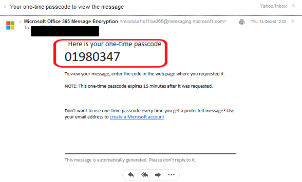

6.  The recipient pastes the passcode into the original email they received.

    

7.  The result is that the email is unlocked, and can be read by the recipient.

    

## Sharing files using Google Workspace

Pre-requisite: Ensure you have a current and correct mobile phone telephone number for each of your recipients. This contact number is used to send them a unique PIN code to unlock shared files.

1.  When your email is ready to send, select the encrypt icon at the bottom of the toolbar. In Google Workspace email, this button is called **Toggle confidential mode**.

    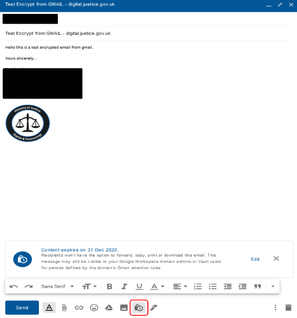

2.  On the Confidential mode panel, select the Radio Button for **SMS Passcode**.

    

3.  Click the **Save** button.

    

4.  Add the mobile telephone numbers for each of the recipients. Click the **Send** button.

    

5.  The result is that an email is sent to each recipient.

    

### Recipient receives the encrypted email

1.  The recipient receives a notification email from Google Workspace, advising that they have been sent an email which can only be accessed by the authorised recipient. Click the **View the email** button.

    

2.  To view the email, the recipient requires a passcode. To get the passcode, click the **Send Passcode** button.

    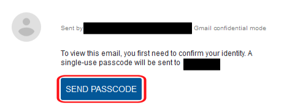

3.  The recipient receives the passcode by SMS text message on their mobile telephone.

    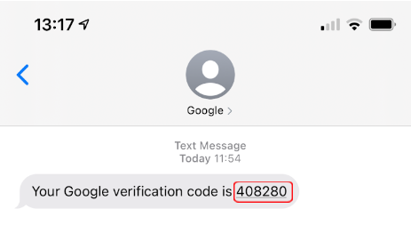

4.  After clicking the **Send Passcode** button, a form appears notifying the recipient that the Passcode has been sent to the indicated phone number. The recipient enters the Passcode from the SMS message into the form, and clicks the **Submit** button.

    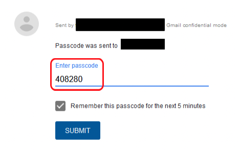

5.  The email is unlocked and viewable by the recipient.

    

### Very large file using Google Workspace

**Note:** This option is only for MoJ Google Workspace users, with `*.*@digital.justice.gov.uk` accounts.

1.  Using Google Drive, locate the large file you want to share. Right click on the file.

    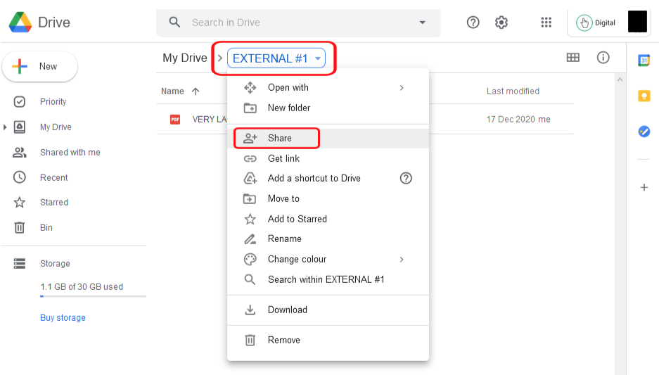

2.  Choose the **Share** option. A form appears, where you can add the user's email address you want to share to. You can also choose what sort of link will be provided. The default is **Restricted**, which means only the specific named recipients can access the file. Leave the default unchanged.

    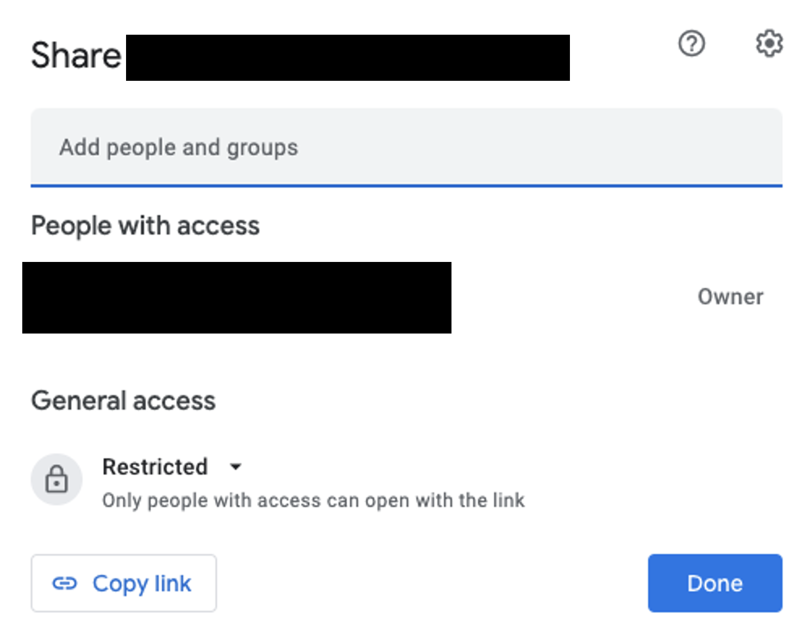

## Contact details

For any further questions or advice relating to security, contact: [security@justice.gov.uk](mailto:security@justice.gov.uk).

## Feedback

> If you have any questions or comments about this guidance, such as suggestions for improvements, please contact: [itpolicycontent@digital.justice.gov.uk](mailto:itpolicycontent@digital.justice.gov.uk).

